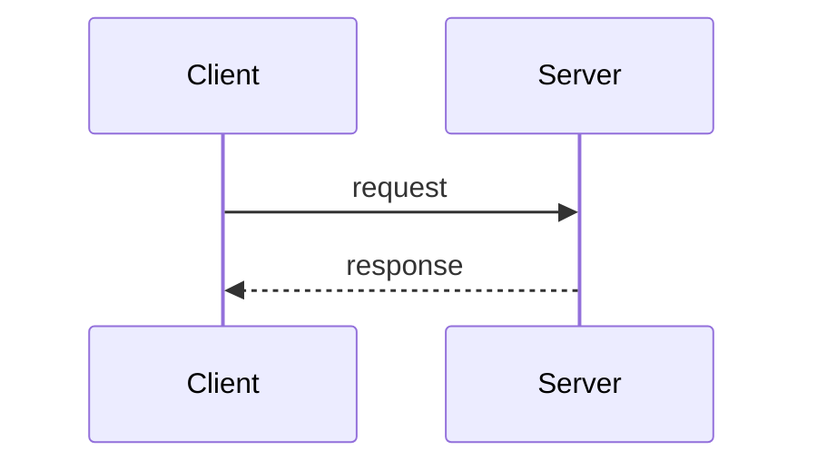

IMPORTANT: `tinyspec` is a native binary CLI tool (installed via cargo/crates.io), NOT an npm package. Run it directly as `tinyspec <command>`. Never use npm, npx, or node to run it.

Read the spec name from `$ARGUMENTS`. If no argument is provided, list available specs with `tinyspec list` and ask the user which one to add diagrams to.

## Process

1. Read the full spec using `tinyspec view <spec-name>`.
2. Analyze the prose in `# Background` and `# Proposal` for sections that would benefit from visualization.
3. For each candidate section, determine the most appropriate Mermaid diagram type and draft the diagram source.
4. Present each proposed diagram to the user using `AskUserQuestion` — show the section heading, a one-sentence rationale, and the Mermaid source. Ask: "Add this diagram to the spec?" (Yes / No / Edit).
5. For each accepted diagram, write it into the spec immediately after the relevant prose paragraph using the Edit tool.
6. After all accepted diagrams are written, run `tinyspec format <spec-name>` to normalize formatting.
7. If no proposals were accepted, leave the spec file unchanged.

## When to propose a diagram

Propose a diagram for a section when:

- The prose describes interactions between two or more distinct components → `sequenceDiagram` or `flowchart`
- The prose describes a state machine, lifecycle, or status progression → `stateDiagram-v2`
- The prose describes a data schema, entity relationships, or object model → `erDiagram`
- The prose describes dependencies between modules, services, or task groups → `graph`

Do not propose a diagram for sections that are already clear from text alone, or where the spec already has a Mermaid block covering the same concept.

## Diagram type selection

|Diagram type|When to use|
|------------|-----------|
|`flowchart`|Decision logic, data pipelines, process flow|
|`sequenceDiagram`|Request/response flows, inter-service calls, API interactions|
|`stateDiagram-v2`|State machines, spec lifecycle, task status transitions|
|`erDiagram`|Data models, schema relationships|
|`graph`|Dependency graphs, component maps|

## Placement

Place each diagram immediately after the prose paragraph it illustrates — not at the end of the section, not in a new section. The diagram should follow naturally from the text it clarifies.

Use fenced code blocks with the `mermaid` language tag:

````

````

## Declining all proposals

If the user declines all proposed diagrams, make no changes to the spec file. Confirm to the user that no changes were made.
