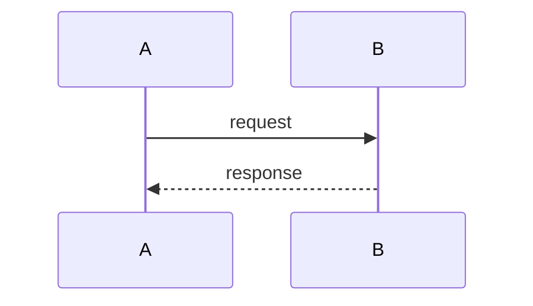

IMPORTANT: `tinyspec` is a native binary CLI tool (installed via cargo/crates.io), NOT an npm package. Run it directly as `tinyspec <command>`. Never use npm, npx, or node to run it.

If `$ARGUMENTS` is empty, check for a focused spec with `tinyspec focus` (no arguments). If a spec is focused, use it. If not, prompt the user to specify a spec or run `tinyspec focus <spec-name>`.

Read the tinyspec specification at `.specs/<spec-name>.md` (resolve the name by matching the suffix after the timestamp prefix, e.g., `hello-world` matches `2025-02-17-09-36-hello-world.md`).

If no matching spec is found, list available specs with `tinyspec list` and ask the user which one they meant.

Your goal is to collaborate with the user to refine this spec:

1. Read the spec using `tinyspec view <spec-name>` to understand the context. This command resolves application references to folder paths automatically.
   - If `tinyspec view` fails with a config error, inform the user that they need to configure repository paths with `tinyspec config set <repo-name> <path>` and stop.
2. If the spec references applications (listed in the `applications` frontmatter field), explore each referenced repository before proposing changes:
   - For each resolved application folder path, explore the directory tree and read key source files to understand the codebase structure, architecture, and patterns.
   - Consider how the proposed changes will interact across all referenced repositories.
   - If no `applications` field is present (or it's empty), explore only the current repository from the working directory onwards.
3. Ask clarifying questions about ambiguous requirements or missing context. Use the `AskUserQuestion` tool to present structured, selectable options rather than asking inline.
4. **Track decisions**: As the user answers questions and makes choices, keep a running list of key decisions with their reasoning. Each decision should capture: the topic, the chosen direction, and the reason (if given).
5. Suggest improvements to the Background and Proposal sections.
6. Once the user is satisfied with the problem definition, scaffold or update the **Implementation Plan**:
   - Break the work into logical task groups (A, B, C, ...)
   - Each group gets subtasks (A.1, A.2, ...)
   - Use markdown checkboxes: `- [ ] A: Task description`
7. If the user wants tests, scaffold the **Test Plan** using Given/When/Then syntax with task IDs (T.1, T.2, ...).
8. Wait for user approval before writing any changes to the spec file.
9. **After the user approves**, append a `# Decisions` section to the spec documenting the key Q&A from the session:

```markdown
# Decisions

- **Topic:** Chosen direction.
  *Reason: Why this was chosen.*
- **Topic:** Another decision.
  *Reason: Rationale.*
```

Use `tinyspec view <spec-name>` to read the current spec and directly edit the file when making approved changes. Keep the front matter and existing structure intact.

After editing a spec file directly, run `tinyspec format <spec-name>` to normalize the Markdown formatting.

## Diagram guidance

When refining a spec, proactively include Mermaid diagrams when they would reduce ambiguity. Don't ask permission — just include a diagram the same way a good technical writer would include a figure. If the user doesn't want it, they can remove it.

Include a diagram when:

- The proposal involves more than two components interacting → use `sequenceDiagram` or `flowchart`
- There is a described state machine or lifecycle → use `stateDiagram-v2`
- The background describes a data schema → use `erDiagram`
- The implementation plan has a dependency graph among task groups → use `graph`

**Diagram type selection:**

|Diagram type|When to use|
|------------|-----------|
|`flowchart`|Decision logic, data pipelines, process flow|
|`sequenceDiagram`|Request/response flows, inter-service calls, API interactions|
|`stateDiagram-v2`|State machines, spec lifecycle, task status transitions|
|`erDiagram`|Data models, schema relationships|
|`graph`|Dependency graphs, component maps|

Place diagrams inline in the spec section they illustrate — immediately after the prose paragraph they relate to, not in a separate section. Use fenced code blocks with the `mermaid` language tag:

````

````
